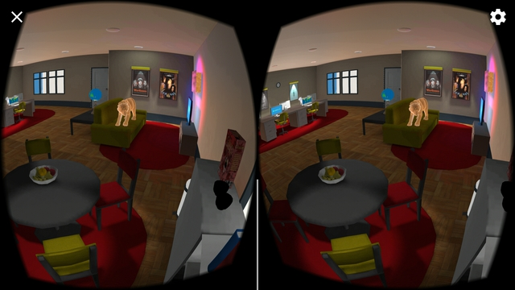
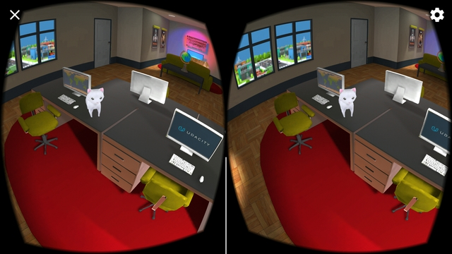
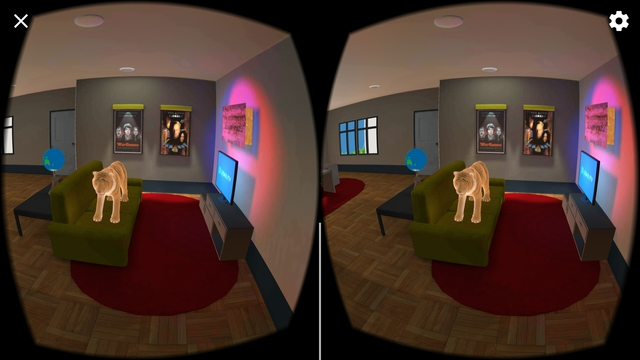

# udnd_02_apartment
udnd Apartment Customization - August 2017

## Project Contents
Quick description of contents within this repo.

* Assets - assets including GoogleVR SDK clips for project
* ProjectSettings - project settings for builds
* .gitignore - ignore file based on Unity footprint
* build.zip - compressed build for Android
* LICENSE - current license
* README.md - this file
* screens/ - examples of screenshots within app

### Customizations
In building the apartement, a few steps were taken to go above just what
was in the build requirements.

* Multiple waypoints
* Color spot lights for different parts
* Area spot lights for under-counter interaction
* A number of textured "posters" to enhance the wallspace
* A few animation on objects and "cats" to play with 
* "Soothing" music background for a design studio

**NOTE**: Because there is no rectile associated with the current GVR viewer,
all clicks will toggle the globe spin on and off.

### Comments
This project was a good chance to build an environment from almost the 
ground-up.  I went a little further by pulling in some outside objects to 
make sure it was a process that was understandable.

* Challenges
  * Baking: The largest challege was finding the right balance of area 
lights and spot lights, mostly because of the time spent lost in 
baking: a slower 2GHz machine is not the ideal environment
  * Alignment: Another challenge that I was surprised to hit was the lack 
of a tool to help align objects to the surface of others.  I learned 
about transforms and components for a UI perspective, but they didn't 
seem to map to 3D objects.
  * Focus and reticle: I tried to move away from any click triggering the
teleporter by using the GVR reticle, but faced some challenges in linking
the event trigger.  Comparing this to the first project, I found the GVR code
had changed significantly between versions so it was too much to touch.
* Positive findings
  * Fun to play with spotlights and see the crisp quality after baking
  * Although shadows prevented totally realistic looks, the inclusion of 
additional real-world objects (movie posters, animals) made the environment
more enjoyable.
  * The inclusion of external meshes was easy, but I have concerns with 
the necessary creation of those objects when it comes to more advanced 
projects.
* Time concerns
  * Overall, it took 6-8 hours to include and arrange all of the items.
  * An additional 4-6 hours was required to get all of the lights into a 
preferred configuration.
  * Scripting and off-line learning were minimal for this project.

## Requirements
Software and build environment requirements.

* [Unity 5.5.1f1](https://unity3d.com/get-unity/download/archive)
* [GVR Unity SDK 1.0.3](https://github.com/googlevr/gvr-unity-sdk/releases/tag/v1.0.3)
* Course starter materials
* Android KitKat 4.4 or later
* [Patch for older android sdk](https://dl.google.com/android/repository/tools_r25.2.5-macosx.zip) as described on [this diagnosis page](https://answers.unity3d.com/questions/1320861/android-build-commandinvokationfailure-unable-to-l.html)

### Extra Assets
A few extra assets were used in the creation of this project.  A best effort attempty includes the original source for this content and associated *free* AssetStore Assets (placed in the [MarketExtra](Assets/MarketExtra) folder).

* [Kitchen Creation Kit](https://www.assetstore.unity3d.com/en/#!/content/2854)
* [Lowpoly Toon Cat](https://www.assetstore.unity3d.com/en/#!/content/66083)
* [Golden Tiger](https://www.assetstore.unity3d.com/en/#!/content/55797)
* [ambient music](https://soundcloud.com/kait-con-botas/3-hours-relaxing-music-yoga-background-meditation-spa-massage-sleep-study1)
* (various internet sources for movie posters)

